<!--
  PROFILE README — Mubasheer KC
  Repo must be named EXACTLY: Mubashir-114 (so GitHub renders it on the profile)
-->

<h3><code>Mubashir-114@github ~ $ whoami</code></h3>

<table width="100%">
<tr>
<td width="50%" align="center" valign="top"></td>
<td width="50%" align="center" valign="top"></td>
</tr>
</table>

 

<h3><code>Mubashir-114@github ~ $ ./contributions.sh</code></h3>

 

<h3><code>Mubashir-114@github ~ $ ./links.sh</code></h3>

<b>Full-Stack Developer · Python &amp; Django · React · Flutter</b>

 

