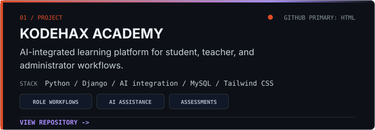
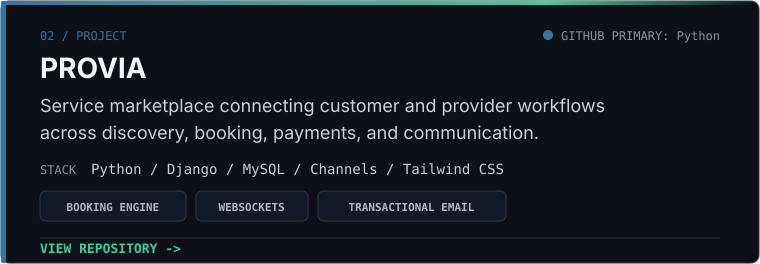
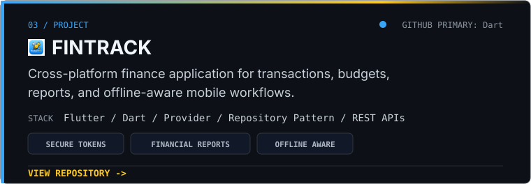
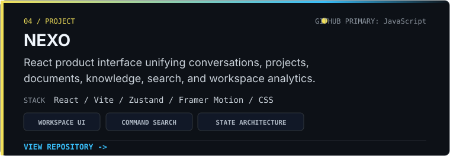

<div align="center">
  
</div>

<p align="center">
  <a href="https://github.com/Mubashir-114?tab=repositories"><strong>Explore my work</strong></a>
  &nbsp;&middot;&nbsp;
  <a href="mailto:mklmubashir575@gmail.com"><strong>Start a conversation</strong></a>
</p>

## `01 / PROFILE`

I am **Mubasheer KC**, a full-stack developer focused on production-oriented web and mobile applications. I work across interfaces, backend systems, REST APIs, databases, authentication, role-based workflows, realtime features, payments, and AI integration.

```text
CURRENT SIGNAL
+-- Web       React interfaces connected to REST APIs and Django systems
+-- Platform  Authentication, RBAC, databases, realtime, and business workflows
\-- Mobile    Flutter applications with structured state and API integration
```

## `02 / NOW`

- Building product-oriented **React** interfaces with deliberate systems and interaction design.
- Developing **Django** platforms with authentication, role-based workflows, APIs, and AI-assisted functionality.
- Building **Flutter** applications around structured architecture, API integration, and practical user workflows.

## `03 / SELECTED WORK`

<p align="center">
  <a href="https://github.com/Mubashir-114/kodehax_academy">
    <picture>
      <source media="(max-width: 600px)" srcset="./assets/projects/kodehax-mobile.svg" />
      
    </picture>
  </a>
</p>

<p align="center">
  <a href="https://github.com/Mubashir-114/Provia">
    <picture>
      <source media="(max-width: 600px)" srcset="./assets/projects/provia-mobile.svg" />
      
    </picture>
  </a>
</p>

<p align="center">
  <a href="https://github.com/Mubashir-114/budgetbee-app">
    <picture>
      <source media="(max-width: 600px)" srcset="./assets/projects/fintrack-mobile.svg" />
      
    </picture>
  </a>
</p>

<p align="center">
  <a href="https://github.com/Mubashir-114/Nexo-frontend">
    <picture>
      <source media="(max-width: 600px)" srcset="./assets/projects/nexo-mobile.svg" />
      
    </picture>
  </a>
</p>

## `04 / TOOLKIT`

<table>
  <tr>
    <td><strong>Languages</strong></td>
    <td><code>Python</code> &nbsp; <code>JavaScript</code> &nbsp; <code>Dart</code></td>
  </tr>
  <tr>
    <td><strong>Frontend</strong></td>
    <td><code>React</code> &nbsp; <code>HTML5</code> &nbsp; <code>CSS3</code> &nbsp; <code>Tailwind CSS</code></td>
  </tr>
  <tr>
    <td><strong>Backend</strong></td>
    <td><code>Django</code> &nbsp; <code>Node.js</code> &nbsp; <code>Express.js</code></td>
  </tr>
  <tr>
    <td><strong>Mobile &amp; data</strong></td>
    <td><code>Flutter</code> &nbsp; <code>MySQL</code> &nbsp; <code>MongoDB</code></td>
  </tr>
  <tr>
    <td><strong>Systems &amp; API</strong></td>
    <td><code>REST APIs</code> &nbsp; <code>WebSockets</code> &nbsp; <code>Authentication</code> &nbsp; <code>RBAC</code></td>
  </tr>
  <tr>
    <td><strong>AI</strong></td>
    <td><code>Local LLMs</code> &nbsp; <code>Prompt Engineering</code> &nbsp; <code>AI Applications</code></td>
  </tr>
  <tr>
    <td><strong>Workflow</strong></td>
    <td><code>Git</code> &nbsp; <code>GitHub</code></td>
  </tr>
</table>

## `05 / ACTIVITY`

<div align="center">
  <a href="https://github.com/Mubashir-114?tab=overview">
    
  </a>
</div>

<sub>The visualization is generated from public GitHub contribution data and refreshed daily by this repository's workflow.</sub>

## `06 / CONNECT`

The best collaborations start with a concrete problem. I am interested in product-focused web work, Django platforms, Flutter applications, and useful AI-assisted experiences.

<p align="center">
  <a href="https://www.linkedin.com/in/mubashir-kc-b630b73a4"></a>
  <a href="mailto:mklmubashir575@gmail.com"></a>
  <a href="https://github.com/Mubashir-114"></a>
</p>

<div align="center">
  
</div>
