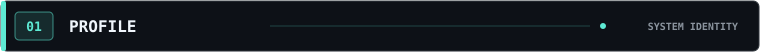
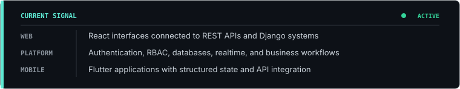
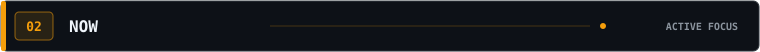
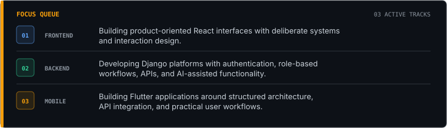
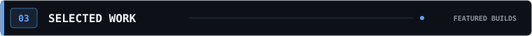
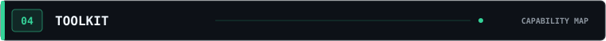
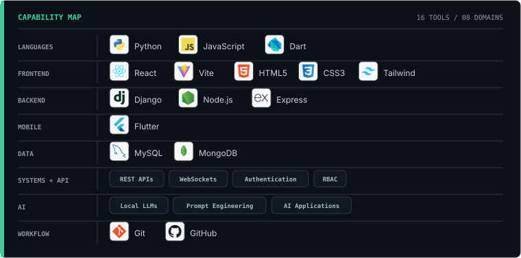
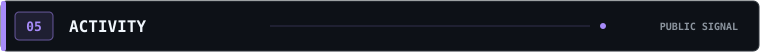
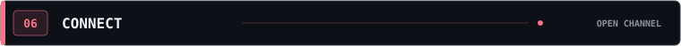

  

  <a href="https://github.com/Mubashir-114?tab=repositories"><strong>Explore my work</strong></a>
  &nbsp;&middot;&nbsp;
  <a href="mailto:mklmubashir575@gmail.com"><strong>Start a conversation</strong></a>

## 

I am **Mubasheer KC**, a full-stack developer focused on production-oriented web and mobile applications. I work across interfaces, backend systems, REST APIs, databases, authentication, role-based workflows, realtime features, payments, and AI integration.

<picture>
  <source media="(max-width: 600px)" srcset="./assets/ui/profile-signal-mobile.svg" />
  
</picture>

## 

<picture>
  <source media="(max-width: 600px)" srcset="./assets/ui/now-mobile.svg" />
  
</picture>

## 

  <a href="https://github.com/Mubashir-114/kodehax_academy">
    <picture>
      <source media="(max-width: 600px)" srcset="./assets/projects/kodehax-mobile.svg" />
      
    </picture>
  </a>

  <a href="https://github.com/Mubashir-114/Provia">
    <picture>
      <source media="(max-width: 600px)" srcset="./assets/projects/provia-mobile.svg" />
      
    </picture>
  </a>

  <a href="https://github.com/Mubashir-114/budgetbee-app">
    <picture>
      <source media="(max-width: 600px)" srcset="./assets/projects/fintrack-mobile.svg" />
      
    </picture>
  </a>

  <a href="https://github.com/Mubashir-114/Nexo-frontend">
    <picture>
      <source media="(max-width: 600px)" srcset="./assets/projects/nexo-mobile.svg" />
      
    </picture>
  </a>

## 

<picture>
  <source media="(max-width: 600px)" srcset="./assets/ui/toolkit-mobile.svg" />
  
</picture>

## 

  

The visualization is generated from public GitHub contribution data and refreshed daily by this repository's workflow.

## 

The best collaborations start with a concrete problem. I am interested in product-focused web work, Django platforms, Flutter applications, and useful AI-assisted experiences.

  
  
  

  

