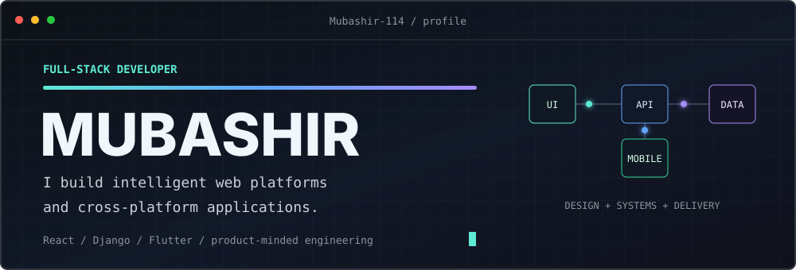

<div align="center">
  
</div>

<p align="center">
  <a href="https://github.com/Mubashir-114?tab=repositories"><strong>Explore my work</strong></a>
  &nbsp;&middot;&nbsp;
  <a href="mailto:mklmubashir575@gmail.com"><strong>Start a conversation</strong></a>
</p>

## `01 / PROFILE`

I am **Mubasheer KC**, a full-stack developer working across product interfaces, backend systems, and cross-platform applications. My public work spans AI-assisted workspaces, multi-role Django platforms, real-time services, and Flutter apps.

```text
CURRENT SIGNAL
├── Product UI      React interfaces with deliberate systems and interaction design
├── Platform work   Django applications with roles, workflows, realtime, and data
└── Mobile          Flutter experiences built around practical everyday workflows
```

## `02 / NOW`

- Building **Nexo**, a React workspace interface for conversations, projects, documents, and knowledge.
- Developing full-stack platforms with **Django**, including booking, learning, messaging, and role-based workflows.
- Exploring how thoughtful interfaces can make AI-assisted products feel focused and useful.

## `03 / SELECTED WORK`

### [01. Kodehax Academy](https://github.com/Mubashir-114/kodehax_academy)

An AI-assisted learning platform with separate student, teacher, and administrator experiences; assessments, daily coding challenges, course workflows, and Gemini-powered tools.

`Python` &nbsp; `Django` &nbsp; `Gemini API` &nbsp; `MySQL` &nbsp; `Tailwind CSS`

---

### [02. Provia](https://github.com/Mubashir-114/Provia)

A service marketplace with multi-role authentication, provider discovery, stateful bookings, reviews, notifications, payments, and live customer-provider chat over WebSockets.

`Python` &nbsp; `Django` &nbsp; `Channels` &nbsp; `MySQL` &nbsp; `Tailwind CSS`

---

### [03. Nexo](https://github.com/Mubashir-114/Nexo-frontend)

A polished AI workspace frontend that brings conversations, projects, documents, knowledge collections, command search, and analytics into one responsive interface.

`React` &nbsp; `Vite` &nbsp; `Zustand` &nbsp; `Framer Motion` &nbsp; `CSS`

---

### [04. FinTrack](https://github.com/Mubashir-114/budgetbee-app)

A cross-platform personal finance app for transactions, category budgets, reports, secure sessions, connectivity-aware behavior, and SMS-assisted expense capture.

`Flutter` &nbsp; `Dart` &nbsp; `Provider` &nbsp; `Dio` &nbsp; `fl_chart`

## `04 / TOOLKIT`

<table>
  <tr>
    <td><strong>Languages</strong></td>
    <td></td>
  </tr>
  <tr>
    <td><strong>Product</strong></td>
    <td></td>
  </tr>
  <tr>
    <td><strong>Backend &amp; data</strong></td>
    <td></td>
  </tr>
  <tr>
    <td><strong>Workflow</strong></td>
    <td></td>
  </tr>
</table>

## `05 / ACTIVITY`

<div align="center">
  <a href="https://github.com/Mubashir-114?tab=overview">
    
  </a>
</div>

<sub>The visualization is generated from public GitHub contribution data and refreshed daily by this repository's workflow.</sub>

## `06 / CONNECT`

The best collaborations start with a concrete problem. I am interested in product-focused web work, Django platforms, Flutter applications, and useful AI-assisted experiences.

<p align="center">
  <a href="https://www.linkedin.com/in/mubashir-kc-b630b73a4"></a>
  <a href="mailto:mklmubashir575@gmail.com"></a>
  <a href="https://github.com/Mubashir-114"></a>
</p>

<div align="center">
  
</div>
